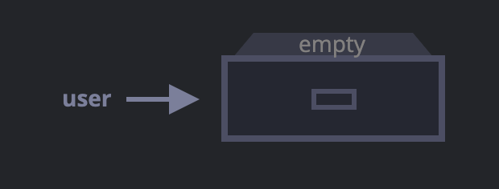
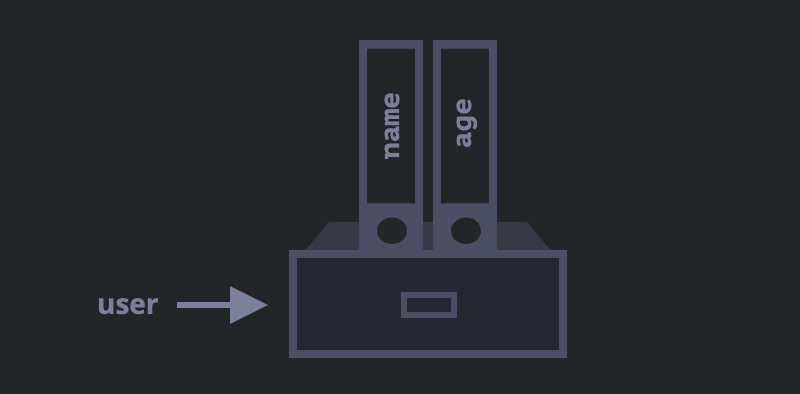
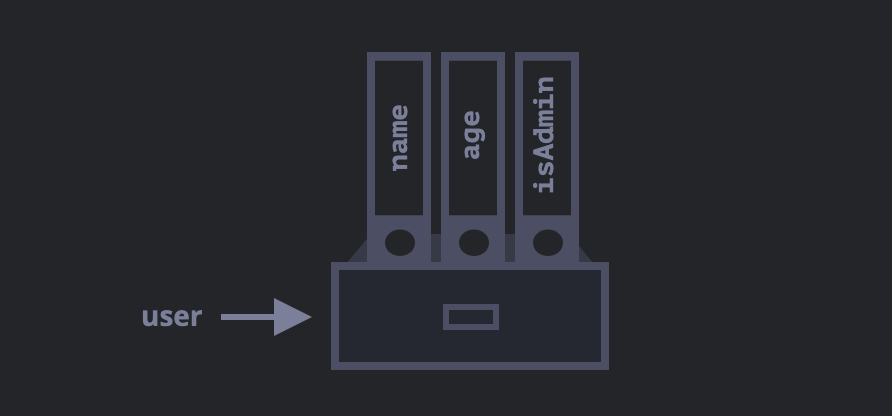
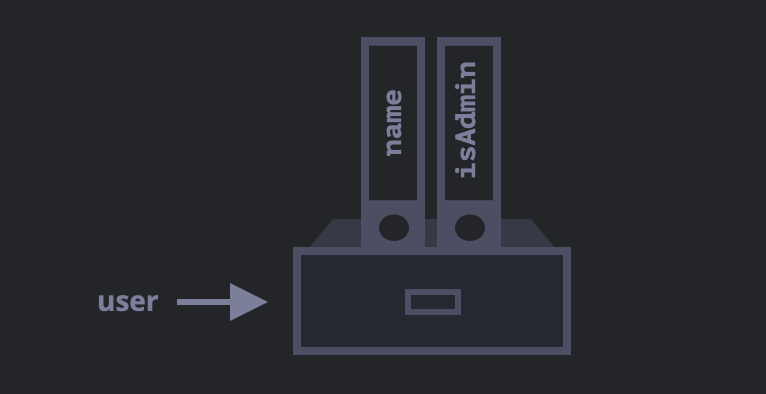
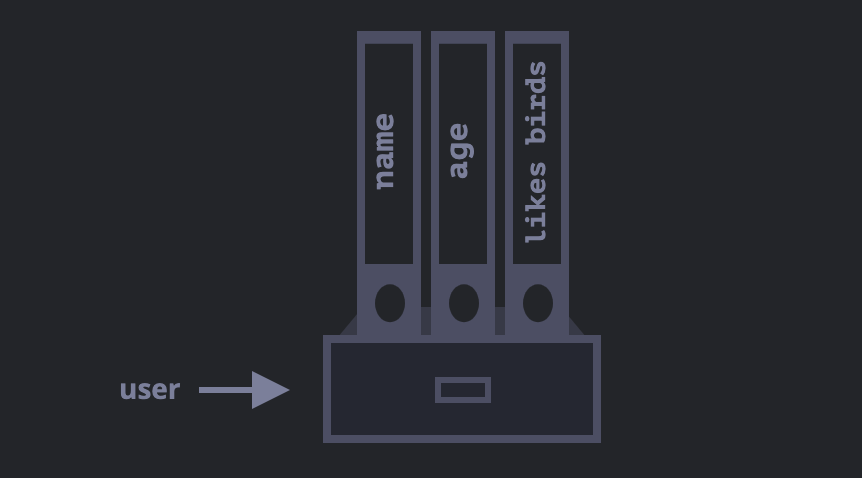

# Chapter 4: Objects basics

This repo is to document the basics about objects in JavaScript. All information used as a reference the book [JavaScrip Info](http://javascript.info)

## Objects

In JavaScript there are **8 data types** seven of them are called _"primitive"_, because their values contain only a single thing (be it a string or a number).

In constrast, objects are used to store keyed collections of various data and more complex entities.

An object can be created with figure brackets `{}` with an optional list of properties. **A property is a "key:value" pair**, where `key` is a string (also called a "property name"), and `value` can be anything.

We can imagine an object as a cabinet with files. Every piece of data is stored in its file by the key, it's easy to find a file by its name or add/remove a file.


An empty object ("empty cabinet") can be created using of two syntaxes:

```
let user = new Object(); // "object constructor" syntax
let user = {}; // "object literal" syntax
```



It's more common to use figure brackets to declare an empty object. That declaration is called an _object literal_.

## Literals and properties

We can create some properties into `{}` as "key: value" pairs.

```
let user = {     // an object
  name: "John",  // key "name" store value "John"
  age: 30        // key "age" store value 30
};
```

A property has a key (also known as "name" or "identifier") before the colon `":"` and a value to the right of it.

In the `user` object, there are two properties:

1. The first property has the name `"name"` and the value `"John"`.
2. The second one has the name `"age"` and the value `30`.

The resulting `user` object can be imagined as a cabinet with two files labeled "name" and "age".



We can add, remove and read files from it at anytime. Property values are accessible using the dot notation.

```
// get property values of the object:

alert( user.name ); // John
alert( user.age ); // 30
```

The value can be of any typ, Let's add a boolean one:

```
user.isAdmin = true;
```



To remove a property, we can use the delete operator:

```
delete user.age;
```



We can aslo use multiword property names, but then they must be quoted.

```
let user = {
  name: "John",
  age: 30,
  "likes birds": true  // multiword property name must be quoted
};
```



> Note: The last property in the list may end with a comma:

```
let user = {
  name: "John",
  age: 30,
}
```

This is called a "trailing" o "hanging" comma. Makes it easier to add/remove/move around properties, because all lines become alike.

## Square brackets

For multiword properties, the dot access doesn't work

```
// this would give a syntax error
user.likes birds = true
```

JavaScript doesn't understand that. It thinks that we address `user.likes` and then gives a syntax error.

The dot requires the key to be a valid variable identifier. That implies: contains no spaces, doesn't start with a digit and doesn't include special characters (`$` and `_`are allowed).

There's and alternative "square bracket notation" that works with any string:

```
let user = {}

// set
user["likes birds"] = true;

// get
console.log(user["likes birds"]);

// delete
delete user["likes birds"];
```

Now everything is fine, please note that the string inside the brackets is properly quoted (any type of quotes will do).

Square brackets also provide a way to obtain the property name as the result of any expression - as opposed to a literal string - like from a variable as follows:

```
let key = "likes birds";

// same as user["likes birds"] = true;
user[key] = true;
```

Here, the variable `key` may be calculated at run-time or depend on the user input. and then we use it to access the property. That gives us a great deal of flexibility.

For instance:

```
let user = {
  name: "John",
  age: 30
};

let key = prompt("What do you want to know about the user?", "name");

// access by variable
alert( user[key] ); // John (if enter "name")
```

The dot notation cannot be use in a similar way

```
let user = {
  name: "John",
  age: 30
};

let key = "name";
alert( user.key ) // undefined
```

## Computed properties

We can use square brackets in an object literal, when creating an object. That's called `computed properties`.

For instance:

```
let fruit = prompt("Which fruit to buy?", "apple");

let bag = {
  [fruit]: 5, // the name of the property is taken from the variable fruit
};

alert( bag.apple ); // 5 if fruit="apple"
```

The meaning of a computed property is simple: `[fruit]` means that the property name should be taken from `fruit`.

So if a visitor enters `"apple"`, `bag` will become `{apple: 5}`.

Essentially, that works the same as:

```
let fruit = prompt("Which fruit to buy?", "apple");
let bag = {};

// take property name from the fruit variable
bag[fruit] = 5;
```

But looks easier, we can use more complex expressions inside square brackets:

```
let fruit = 'apple';
let bag = {
  [fruit + 'Computers']: 5 // bag.appleComputers = 5
};
```

Square brackets are much more powerful than dot notation. They allow any property names and variables. But they are also more cumbersome to write.

So most of the time, when property names are known and simple, the dot is used. And if we need something more complex, then we switch to square brackets.
